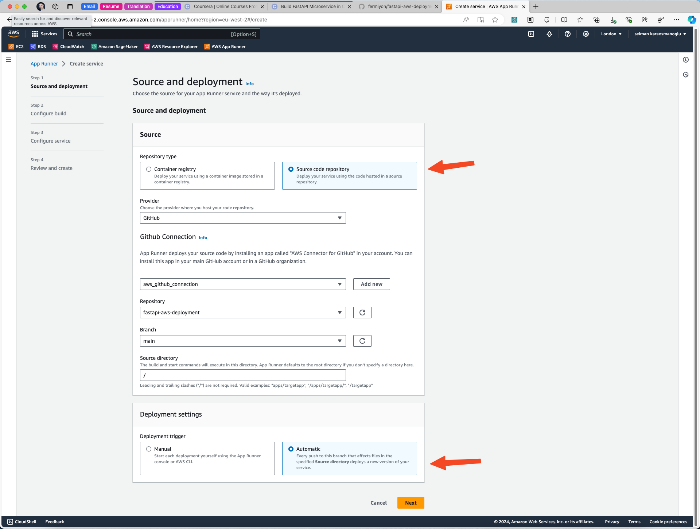
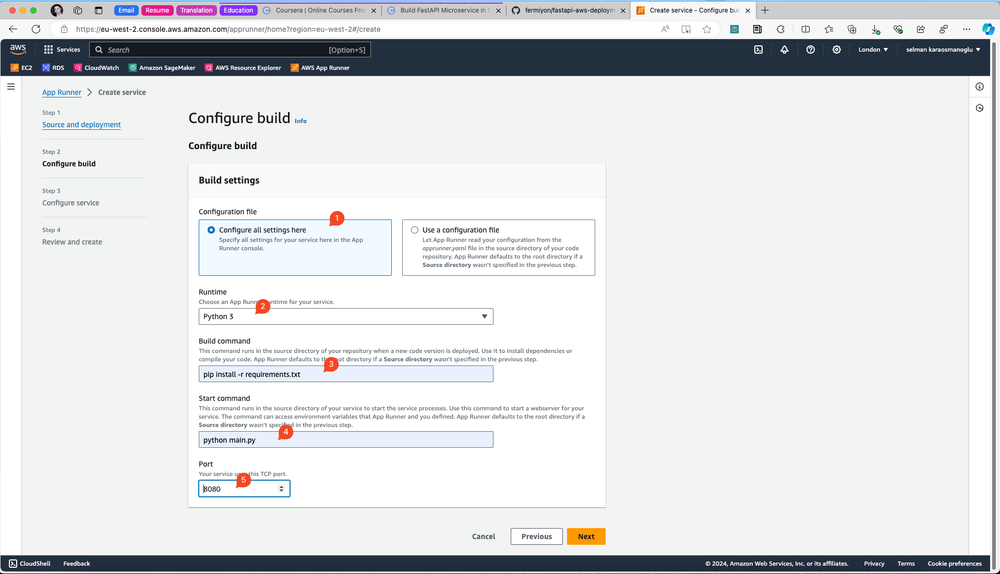
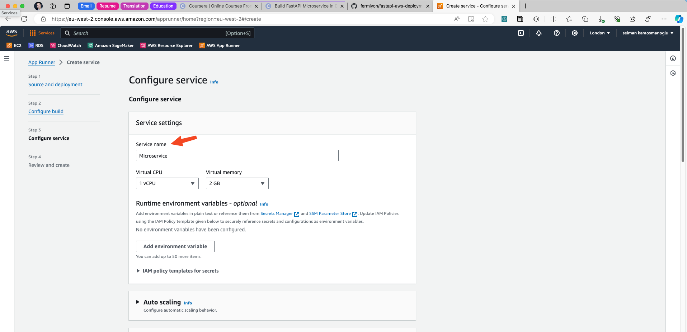
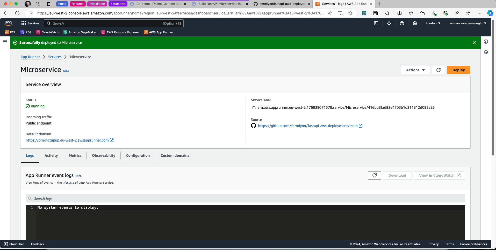
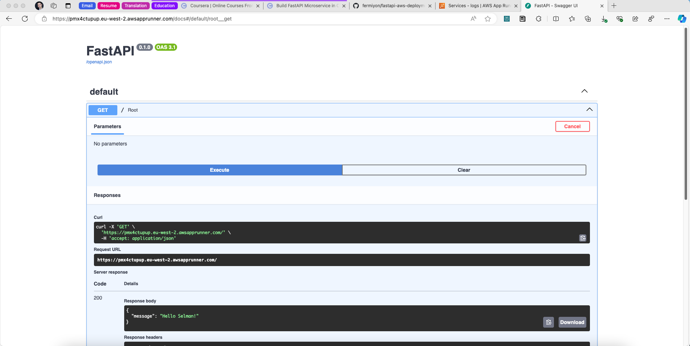

# FastAPI + AWS App Runner

This repository demonstrates how to deploy a FastAPI application using AWS App Runner.

## run docker
`docker build -t fastapi-demo .`

Find container name using: `docker image ls`

`docker run -p 127.0.0.1:8080:8080 fastapi-demo`

## Verify Swagger Working

## References

* Duke University - Virtiualization, Docker and Kubernetes Data Engineering Program
